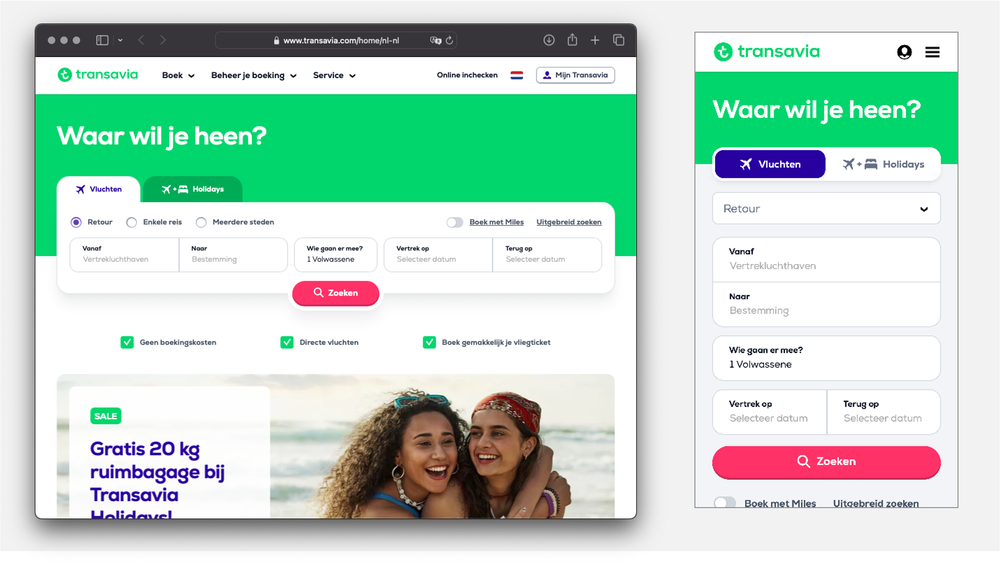
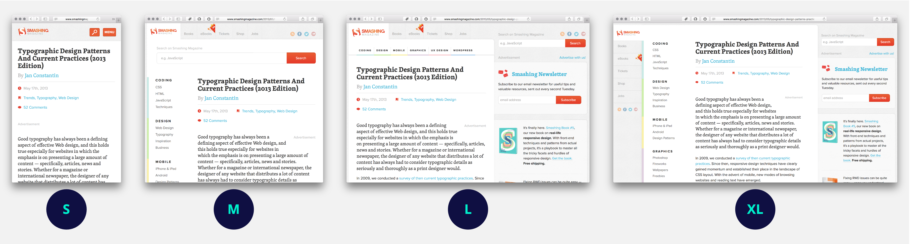

# The Startup - Responsive Interactive Website

## Mobile First

Over Mobile First bouwen en breakpoints bepalen van jouw responsive design.

<!--
OUTLINE 

- Mobile First als design strategie
    Wat is Mobile first?
- One Column layout
    Begin met de One column layout (en de huisstijl)
- Breakpoints bepalen
- Media query toepassen met min-width
    (welke features heb je allemaal in een media query heb je allemaal? Vandaag met '`width')
    (Media queries nesten, zoals code conventions)

*Code/Design review - Mobile First*
Vrijdag de toegepaste huisstijl testen in de one-column layout. 
En de min-width in de media-query voor de layout

-->


## Aanpak

Mobile First is niet alleen hoe je met code een responsive website maakt, het is ook een manier van denken. Mobile First is een design strategie. Als je ontwerpt voor een klein scherm (Small, dan moet je goed nadenken over welke content belangrijk is en in beeld moet komen te staan. 
Dat is bijvoorbeeld voor een iPhone SE, met een _viewport_ van 320px × 568px, best een uitdaging!


*Op de website van Transavia staat de belangrijkste informatie altijd goed in beeld, ook voor hele kleine schermen.*

Je gaat de opdracht die je hebt gekregen Mobile First bouwen. Je begint met een _HTML prototype_, daarna maak je met CSS een _One Column Layout_, daarna bepaal je de _breakpoints_ van jouw responsive ontwerp en maak je met behulp van een media query de layout voor bredere schermen.

## HTML prototype

Begin aan de hand van je schetsen met het schrijven van de HTML. Zorg voor een goed fundament, begin met alle content en een goede structuur, waarmee je een werkend prototype bouwt. [Valideer je HTML](https://validator.w3.org/) regelmatig om fouten te voorkomen.

Maak een issue aan met de titel 'Prototype naar HTML', voeg schetsen en uitleg toe en koppel de commits van de HTML die je gaat coderen aan het issue.
Als je het HTML prototype af hebt, vraag dan om een code-review; _tag_ hiervoor een mentor of docent in de comment van je issue. Als de feedback goed is, sluit je het issue. 

## One Column Layout

Als de HTML klaar is, staan de _block-level_ elementen netjes onder elkaar, en de inline-level elementen naast elkaar. Over het algemeen zullen de meeste elementen in One Column Layout ook onder elkaar staan (met uizondering van bijvoorbeeld _inline_ navigatie items). 
Zorg er _eerst_ voor dat je de huisstijl toepast in CSS, voordat je de website responsive maakt met media queries en meer complexere layouts en interactie gaat bouwen. 

Doe een **Interface inventory** op basis van het ontwerp dat je hebt gekregen, en maak een **styleguide**. 
Bekijk welke onderdelen geschreven kunnen worden met herbruikbare **custom properties**, denk bijvoorbeeld aan kleuren, font-sizes, borders, breedtes en/of hoogtes van elementen. 

Maak een issue aan met de titel 'One Column Layout', voeg uitleg over de huisstijl toe en koppel de commits van de CSS die je gaat coderen aan het issue. Sluit het issue als je de huisstijl netjes hebt toegepast.


## Breakpoints

Een breakpoint is een schermbreedte waar de layout verandert, zodat de leesbaarheid en bruikbaarheid van een website goed blijven.
Bijvoorbeeld als de tekstregels langer worden dan 10–12 woorden, moet je de layout aanpassen. Of als plaatjes zo groot worden dat ze andere content uit beeld duwen, dan kan je misschien beter 2 of meer plaatjes naast elkaar tonen...

Stephen Hay schrijft hierover: 

> Start with the small screen first, then expand until it looks like shit. Time for a breakpoint!

### Responsive Design in Figma

Maak in Figma verschillende layouts, voor een Small screen heb je de One Column layout, voor een Medium screen kan je 2 kolommen tonen, voor een Large screen en XL screen is er veel meer ruimte beschikbaar en kan je de layout en witruimte anders ontwerpen. Voor elke schermbreedte kan je meerdere kolommen tonen en de layout veranderen. 


*De website van Smashing Magazine heeft 4 layouts, voor Small, Medium, Large en XL schermen.*

### Media queries

Als je de verschillende layouts in Figma hebt gemaakt, kan je met CSS de breakpoints toevoegen. 
Breakpoints maak je met `media queries`. In de `media query` schrijf je code voor de nieuwe layout.

Je eerste breakpoint zet je op het moment dat de One Column Layout er niet meer goed uitziet. Een regel hiervoor is dat tekst niet meer dan 10 à 12 woorden op één regel mag bevatten om de tekst goed leesbaar te houden. Voeg door middel van een `media query` met `min-width` een breakpoint toe. 

Dat ziet er dan bijvoorbeeld zo uit: 

```css
body {
    line-height: 1.5;
    @media (min-width: 30em) {
        display: grid;
        grid-template-columns: 1fr 1fr;
    }
}
nav {
    display: flex;
    @media (min-width: 26em) {
        justify-content: space-between;
    }
}
footer {
    text-align: right;
    @media (min-width: 32em) {
        text-align: center;
    }
}
```

Maak een issue aan met de titel 'Mobile First', voeg screenshots van de verschillende layouts toe met uitleg. Koppel de commits van de CSS die je gaat coderen aan het issue.


### Bronnen
* https://developer.mozilla.org/en-US/docs/Web/CSS/CSS_media_queries/Using_media_queries
* https://css-tricks.com/a-complete-guide-to-css-media-queries/
