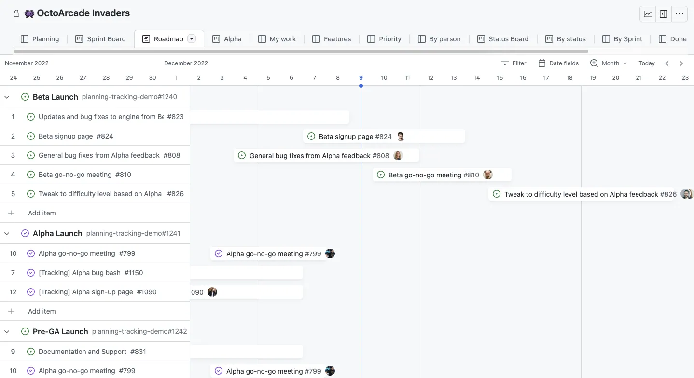

# The Startup - Responsive Interactive Website

## Sprint planning

Project plannen en de briefing voorbereiden.

<!-- Je begint een project altijd met een Sprint Planning, dan weet je wat je de komende weken gaat doen en wat er van je wordt verwacht. -->

### Aanpak

Deze sprint krijg je een opdracht van een frontend bureau. In 3 weken ga je een responsive website met een interactie ontwerpen en maken. 

Vandaag ga je de Repo alvast klaarzetten met een projectboard, daarna ga je de briefing voorbereiden. 
Zorg dat je opdrachtgever na de briefing zo snel mogelijk de debriefing krijgt om te checken of je de opdracht goed hebt begrepen. 
Daarna kan je beginnen met prototypen.

Doe de Sprint planning met de studenten die dezelfde opdrachtgever hebben. 
<!--Jullie kunnen samen de briefing voorbereiden en een debriefing opsturen.-->

## Repo klaarzetten met een projectboard

Fork en Clone deze leertaak. 
Zet je issues in je nieuwe repo aan, 

### Planning maken

Teken een schema op het whiteboard voor de komende 3 weken.
Bekijk het programma van Sprint 6 en neem de belangrijke momenten en opdrachten uit het programma op in het schema.

Belangrijke momenten zijn de code/design reviews op vrijdag; wat moet je elke week ongeveer afhebben? 

### Projectboard

Maak een nieuw project board aan en koppel het aan jouw repository van Sprint 6, en voeg de planning van het schema toe.

Als je het project board op *Roadmap* zet, krijg je een overzicht met je taken en een tijdplanning. Zo kun je taken en issues ook een _tijdspad_ geven.

*De Roadmap-view van Github projects geeft een overzicht van taken en tijdsplanning.*

### Bronnen
- [Changing the layout of a view - Github docs](https://docs.github.com/en/issues/planning-and-tracking-with-projects/customizing-views-in-your-project/changing-the-layout-of-a-view)
- [About date fields](https://docs.github.com/en/issues/planning-and-tracking-with-projects/understanding-fields/about-date-fields)

## Briefing/debriefing

Bereid met studenten die dezelfde opdrachtgever hebben de briefing voor. 
Volg hiervoor de instructies van de workshop briefing/debriefing uit Sprint 2.

### Debriefing

Na de briefing van de opdrachtgever werk je eerst je eigen debriefing volledig uit. 
Maak daarna 1 debriefing met de studenten die dezelfde opdracht hebben en stuur het op naar de opdrachtgever. 
Je wil hier zo snel mogelijk feedback op, dus doe dit asap.

Maak een issue aan in jouw repo met de titel 'Briefing/debriefing', voeg de documentatie en debriefing toe en noteer hier zo nodig de feedback van de opdrachtgever.
Voeg het issue toe aan jouw project board met de roadmap en geef het een *tijdspad*.

## Prototypen

Nu je weet wat (ongeveer) de bedoeling is, kan je beginnen met prototyping; schets je ideeën, een Sitemap en/of een HiFi ontwerp in Figma. 
Maak als eerste het ontwerp in HTML voordat je met CSS begint. Je gaat de **Mobile First** strategie toepassen.

### HTML prototype
Maak een issue aan met de titel 'Prototype naar HTML', voeg schetsen en uitleg toe en koppel de commits van de HTML die je gaat coderen aan het issue.
Voeg het issue toe aan het project board met een *tijdspad*. Wanneer moet dit af zijn?

Volg hiervoor de instructies van de workshop Prototyping uit Sprint 2.

### One Column Layout
Maak een issue aan met de titel 'One Column Layout', voeg een interface inventory, de styleguide en uitleg van CSS strategie toe en koppel de commits van de CSS die je gaat coderen aan het issue.
Voeg de issue toe aan het projectboard met een *tijdspad*.

Als je voor alle content nette HTML hebt gemaakt (en getest met de HTML validator), ga dan verder met de **One Column Layout** in CSS. Zorg er eerst voor dat alles onder elkaar staat en voldoet aan de huisstijl voordat je de website responsive maakt met media queries en meer complexere layouts en interactie gaat bouwen.

Volg hiervoor de instructies van de workshop Styleguide en Stylesheet uit Sprint 4. Dit keer ga je ga je dit individueel doen. 

### Bronnen
1. [Workshop briefing/debriefing](https://github.com/fdnd-task/the-client-website/blob/main/docs/briefing-debriefing.md)
2. [Workshop Prototyping](https://github.com/fdnd-task/the-client-website/blob/main/docs/prototyping.md)
3. [Workshop Styleguide](https://github.com/fdnd-task/look-and-feel-corporate-identity/blob/main/docs/styleguide.md)
4. [Workshop Stylesheet](https://github.com/fdnd-task/look-and-feel-corporate-identity/blob/main/docs/stylesheet.md)

